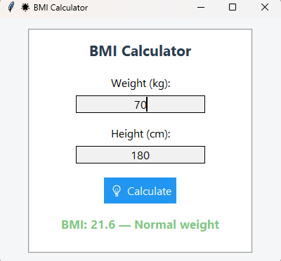

# 🌟 BMI Calculator (Tkinter GUI)

A modern and user-friendly **BMI (Body Mass Index)** calculator built with Python and Tkinter.  
This app helps users easily calculate their BMI based on their height and weight, and visually indicates the health category.

---

## 📸 Preview

 

---

## 🚀 Features

- 🖥️ Beautiful, modern graphical user interface
- 🧮 Accurate BMI calculation
- 🌈 Color-coded result based on health category:
  - Green → Normal
  - Orange → Overweight
  - Red → Obese
  - Yellow → Underweight
- ⚠️ Input validation and error handling

---

## 🧠 What is BMI?

**BMI** is a measure of body fat based on height and weight.  
It is used to determine whether you are underweight, normal, overweight, or obese.

---

## 🛠️ Technologies Used

- Python 3.x
- Tkinter (for GUI)

---

## 📦 How to Run

1. Make sure you have Python 3 installed.
2. Clone the repository or download the `.py` file.
3. Run the app:

```bash
python bmi_calculator.py
````

---

## ✅ BMI Categories

| BMI Range   | Category      |
| ----------- | ------------- |
| < 18.5      | Underweight   |
| 18.5 – 24.9 | Normal weight |
| 25 – 29.9   | Overweight    |
| ≥ 30        | Obese         |

---


---

اگر خواستی می‌تونم نسخه فارسی‌شده‌ی همین `README` رو هم برات درست کنم یا لینک‌دهی به گیت‌هابت رو اضافه کنم. همچنین برای اسکرین‌شات پیشنهاد می‌کنم یک عکس از برنامه بگیری و با نام `screenshot.png` داخل پروژه بذاری تا توی بخش Preview نمایش داده بشه.
```
